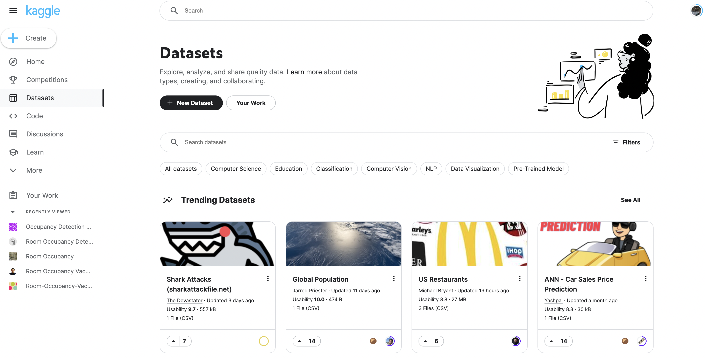
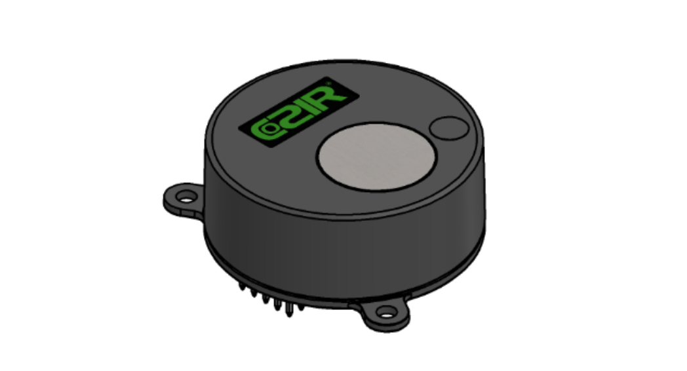

# Room Occupancy Hackathon Project

In October of 2022 I facilitated a department-wide Hackathon week at Mersive. One of the projects used Exploratory Data Analysis and Machine Learning techniques to implement a room-occupancy classifier. This folder contains my contributions.

## Machine Learning Language Learning Club

To build skills in the team that participated, we identified a Udemy course - [Python for Data Science and Machine Learning Bootcamp](https://www.udemy.com/course/python-for-data-science-and-machine-learning-bootcamp/) -  and created a language learning club that met once or twice a week to discuss lectures and share solutions to exersizes.

Topics covered in time for the hackathon:

- Python for Data Science, Anaconda Environments, Jupyter Notebooks
- Popular Python libraries such as Numpy, Pandas, Scikit-Learn, etc.
- Popular Data Visualization Tools such as Matploylib and Seaborn
- Linear and Logistical Regression
- K-Nearest Neighbors and Clustering
- Decision Trees and Random Forests
- Support Vector Machines

Future sessions will dive into Natural Language Processing and Neural Networks

## We knew we wanted a ML hackathon project, but what problem to solve?

The issue boils down to data. We didn't expect to have a lot of time to create our own labeled dataset for training so I searched [kaggle.com](https://www.kaggle.com/) for datasets that could inspire project ideas:

We settled on room-occupancy detection using a multi-function CO2 sensor. There were three or four unique datasets to choose from, all of which contain the following features.

- temperature
- humidity
- CO2 
- ambient light 

I train my classifier on [this dataset](https://www.kaggle.com/datasets/kukuroo3/room-occupancy-detection-data-iot-sensor).

## Project Overview

- We acquired a multi-function CO2 sensor

- The sensor plugs into a pod via USB
- We collect a sample from the sensor every 5s
- Data is pushed up to a cloud service
- The cloud service parses and formats the data
- The data is fed to the trained machine learning model
- The model makes an occupancy prediction and returns to the pod
- The pod enables or disables the HDMI output

## What we developed

- Deep dive into SVM and Random Forest Classifiers
- Trained classifier
- Scripts to collect data and generate labeled datasets
- Solstice Module to control the sensor and present an API
- Script to parse and format data samples
- Deployed Flask server for cloud service
- Cloud service to read sample and return prediction
- Service to feed training data and train the model